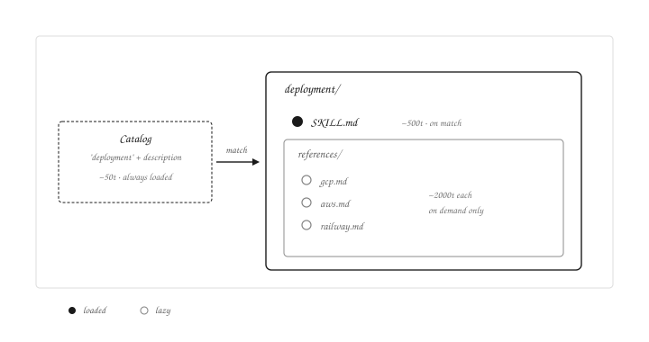
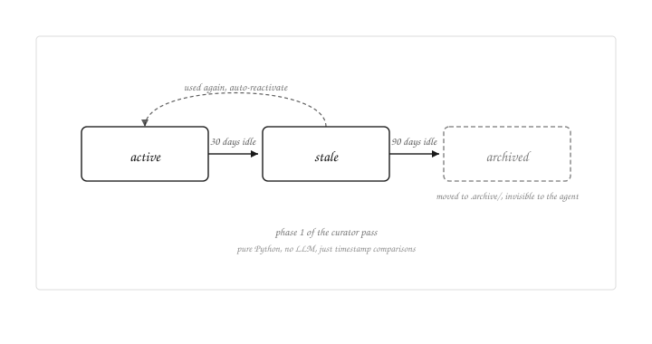

Some months ago, Hermes Agent exploded in virality as being an open source agent harness that could self-improve itself. Because it is open source, that self-improvement loop was there for everyone to see from day one. I just never made the time to actually look at how it worked.

From that first launch, Nous Research team have been improving the product a lot, making people forget about the last reigning king, OpenClaw. Some days ago, they released a new feature called The Curator that made me full stop and analyze what was there, because I had the feeling it was something that I would love.

## So first of all, what is a harness
So to explain it simply, it's everything that wraps the LLM to turn it into an agent; the loop that lets it think, call tools, see results, and think again, plus context management, tool management, error recovery, sandboxing etc. Claude Code, Codex and Hermes are examples of harnesses.

There are harnesses specific to one provider, like Claude Code and Codex, but in reality, all harnesses could be used with any provider if you had the source. You can argue they have subtle optimizations on system prompts or cache control, but they will work anyways.

## The self-improvement loop
So the thing that made Hermes stand out, as I said before, is self-improvement. Hermes Agent is able to auto generate knowledge based on the workflows you do with the agent. If today I'm doing a deploy using my Hermes Agent with MCPs, 2 weeks later I will ask him to do another deploy, and without me having to explain the process again, he will handle it. He actually learns, or something like that.

In reality, what is happening, is the following.

### The tool
Hermes has a specialized tool called skill_manage, it can totally CRUD skills, so encouraged at the system prompt level, hermes is advised to call this tool after any complex workflow to save that knowledge and reuse it. As skills are pretty efficient with context because just the definitions load before being used, it's a pretty nice way of conserving utility without killing context. As I said, it's a CRUD, so hermes can also patch skills to change the workflow or add new steps, abilities etc.

The main agent itself can call this tool during a conversation when it judges the work worth saving, the system prompt nudges it after any complex workflow. Sometimes it remembers, sometimes it doesn't, and that's where the next piece comes in.

### The background reviewer
The problem with having only the tool, is that being at system prompt level means there is no guarantee it's going to be called, so after a pretty tough work, the agent may have filled much of its context window and it may forget to call the tool, and that's a problem, because that work that filled the context window should probably be a new skill.

Here enters the background reviewer, it's just as simple as a subagent that runs in parallel to the main agent without interrupting the conversation.

There is a counter that accumulates tool calls across the whole session, and when it reaches 15 (configurable) at the end of a user turn, the reviewer triggers. The counter resets to 0 every time skill_manage gets called, so saving a skill restarts the count. Yes, it's just a counter and an if, that simple, but it works so good. So if you ask the agent to do something and it uses 28 tools (pretty common these days), the reviewer kicks in at the end.

When it triggers, the reviewer is handed the full conversation and asked one question: is anything here worth saving as a skill? It runs in the background while you keep talking to the main agent, and if the answer is yes it calls skill_manage on its own.

This agent has the same skill_manage tool with full CRUD access, including delete, but its prompt biases it heavily toward patch and create. Deletion is never even mentioned, so the reviewer just naturally avoids it.

### The Curator
This is the new guy in the family, and for me, the best one. It's another subagent that gets triggered every ~7 days (configurable). Unlike the reviewer that only avoids deletion implicitly, the Curator's prompt has an explicit "DO NOT delete" rule. So what does he actually do?

The Curator has two jobs.

The first job is organization. If I have 5 skills about deployments using google cloud, aws or railway, the Curator will fold them into a single deployment umbrella. The umbrella's SKILL.md is small, basically "figure out which platform first, then load references/<platform>.md". The actual deployment workflow for each platform lives in those reference files (gcp.md, aws.md, railway.md...). Only the SKILL.md loads when the umbrella activates, the reference files stay on disk until the agent explicitly opens one. Real lazy loading.

Why does this matter? The system prompt only loads the catalog (name + description per skill), not the full SKILL.md, so each one is cheap individually but they pile up with hundreds. And when I say "I want to deploy", the agent might speculatively load 2 or 3 narrow skills before figuring out which one I actually need. With one umbrella, "I want to deploy" loads only the umbrella SKILL.md, which then asks "hey where do you want to deploy?" and pulls just the right reference.

The second job is lifecycle management. The first thing I asked myself when learning about Hermes was, how do you manage 100k skills accumulating after 6 months of use? The Curator handles it with a simple 3-state machine: active (recently used or created), stale (30 days without use), and archived (90 days without use). Stale is a soft state, the skill still works normally, it's just flagged for the Curator's attention. Archived is the hard state, the skill is moved into a .archive/ directory and becomes invisible to the agent, though still recoverable.

The elegant part is how the Curator actually runs both jobs. Each pass of the Curator has two phases. Phase 1 is pure Python, no LLM at all, it just walks the skills and applies the state machine based on last_activity_at. No tokens burned. Phase 2 is the LLM review pass, which sees the post-transition state and makes the higher-level calls like umbrella consolidation or patching drift (e.g., a skill that referenced a deprecated flag gets updated to the current one). They specifically didn't burn tokens on something a timestamp comparison can do, and that's part of the simplicity I love about this design.

One last thing worth knowing: pinning. Run `hermes curator pin <skill>` and that skill becomes untouchable, the curator skips it in both phases, the reviewer can't patch it, even the agent's own skill_manage refuses to modify it. Use it for skills you authored by hand or want to keep stable no matter what. It's the user's manual override on the whole self-improvement loop.

That's the whole loop. A tool, a reviewer, a curator. Three pieces, each small but making a big impact. The curator is what pushed me to analyze Hermes in the first place, creating skills is the easy part, not bloating the context with them is what's hard.
