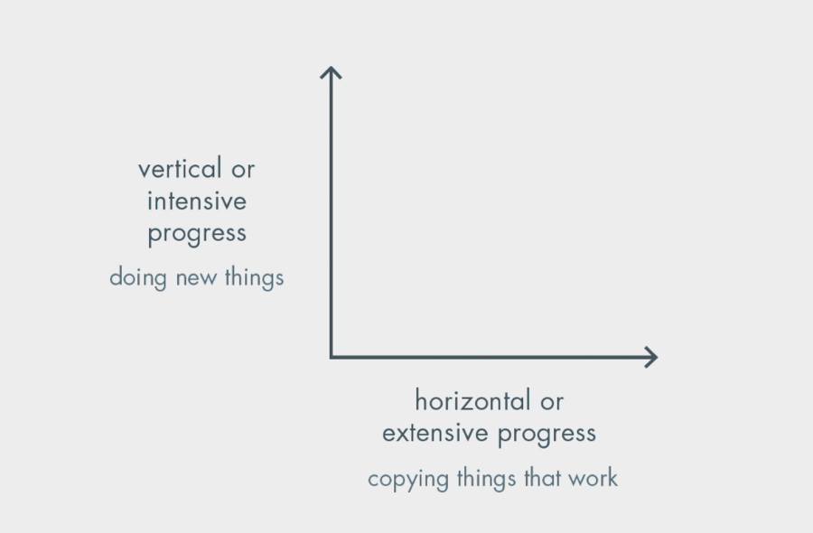

A few weeks ago, two friends who run their own companies recommended Peter Thiel's *Zero to One*. I read it and it earned the reputation. It's sharp, contrarian, and full of lessons any founder should sit with.

But one idea stayed with me longer than the rest, not because it taught me something new about startups, but because it gave me words for a mindset I already had and couldn't articulate. The core distinction of the book is between 0→1 (making something new) and 1→n (copying what works). Thiel uses it as a framework for building companies. I've been treating it as a framework for building a life.

*From Zero to One, by Peter Thiel.*

## 0 to 1 is a moral claim

The most meaningful thing a human being can do, I think, is push the species forward in some way. Not just survive, not just thrive personally, but leave the world with something it didn't have before. Most of what we do in a lifetime is maintenance: working, earning, raising families, resting. That kind of effort keeps the engine of society running, and none of it is worthless, but none of it actually moves us anywhere new. What moves us is 0→1: someone creating a thing that didn't exist, finding a truth nobody had seen, or solving a problem everyone had quietly decided was unsolvable. The people we still remember decades and centuries later tend to have one thing in common, which is that they took humanity somewhere it couldn't have gotten to on its own.

That doesn't make 1→n useless. On the contrary, it's what transforms a single breakthrough into something everyone can use, and the process of scaling an idea, distributing it, improving it, and making it boring is exactly how a 1 becomes part of daily life. But if you treat 1→n as the goal rather than as the fuel that funds the next leap, you've already settled. A life spent entirely on 1→n is a life spent keeping what already exists alive. That's a perfectly good way to live. It just doesn't add anything new to the pile.

## 0→1 is smaller than you think

When most people hear 0→1, they picture something dramatic: a lab coat, a eureka moment, a patent that changes an industry. That's the image the book tends to lean into, and it's probably the main reason people give up on the idea before they even try. They look at the examples and conclude they aren't the kind of person who produces things like that.

I think that framing is too narrow. A 0→1 doesn't need to be a civilization-scale invention. It can be a different way of doing something that has been done the same way for years, or a tiny improvement nobody bothered to make because nobody thought it was worth making. It can be a question nobody had thought to ask, or a reframe of an old idea that finally makes it useful again. The bar isn't "invent electricity." The bar is "move something, in any direction, that wasn't moving before."

You don't need to be exceptional to do that. You need to be honest about where you can actually push, which usually means looking at the unglamorous parts of whatever field you're in. Every domain has edges where nobody is paying attention, not because the problems are genuinely hard but because they're unfashionable, or unsexy, or buried under enough layers of accepted practice that people have stopped questioning them. Those edges are where normal people produce 0→1s, and most of them never get called 0→1s at all.

## The case for 0.2

The honest thing to admit is that most people who seriously chase a 0→1 won't reach 1. Something goes wrong along the way: the idea turns out to be less tractable than it seemed, the timing is off by a decade, the discipline runs out, or the pieces simply don't come together in the lifetime of the person trying. They get to 0.2, or 0.4, or 0.8, and at some point they run out of runway, patience, or life itself. The part I want to argue for is that this isn't a failure at all.

What we usually call "a 1" is almost always a compression of many partial attempts by many people, flattened in memory into a single name. Behind every breakthrough that made it into a textbook, there is a messy history of people who got to 0.2 and couldn't go further, whose work became the ground the eventual 1 was built on. The person whose name ended up attached to the final version wasn't necessarily smarter or more visionary than the ones who came before them. They were often just later, standing on a stack of 0.2s tall enough to see what the remaining step looked like.

So if you spend your life trying to reach your 0→1 and only get to 0.2, you haven't failed. You moved the frontier slightly, and someone else, maybe decades after you're gone, will pick up where you stopped and finish what you started. They will get the name in the history books, while you get the quieter satisfaction of having contributed to something that mattered. A world where everyone keeps chasing their 0.2s is a world where 1s keep happening. A world where people wait for someone else to make the leap is a world that quietly stalls.

## n makes the next 1 possible

If you take this argument too seriously, you run the risk of starting to look down on 1→n work, as if scaling, productizing, teaching, maintaining, and simplifying were somehow beneath the real work of creation. That would be a mistake. Today's novelty becomes tomorrow's infrastructure, and the whole process of that transformation is 1→n. The calculus that was once a breakthrough is now part of a high school curriculum. The database technology that used to take a PhD to understand is now a single import in someone's weekend project. That flattening of difficulty, that absorption of yesterday's frontier into today's baseline, is what makes the next frontier reachable at all. The thicker the layer of solved problems beneath your feet, the higher the next 0→1 can aim.

Every genuine leap stands on a tall, unglamorous tower of careful repetitive work, and most of your life will be spent adding bricks to that tower in one way or another. That's exactly as it should be. The mistake would be to confuse the tower for the view. The point of the tower is that it lets you, or someone who comes after you, see clearly enough to take a step nobody has taken before, and then the job becomes adding bricks again so that the next person can stand even higher.

## The question

If you set aside the startup framing for a moment, along with the specific vocabulary of unicorns and monopolies that dominates most conversations about the book, you are left with a very simple question, and I think it is the one everyone should be asking themselves throughout their working life. It is whether you are pushing something, however small, forward that wasn't moving before. If the honest answer is yes, you're contributing, and you should keep going. If the honest answer is no, then the job is to find the smallest edge you can push, and start there.

Pursue the 1.
