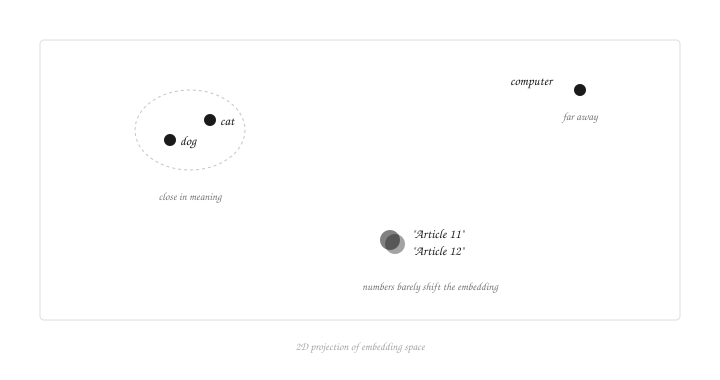
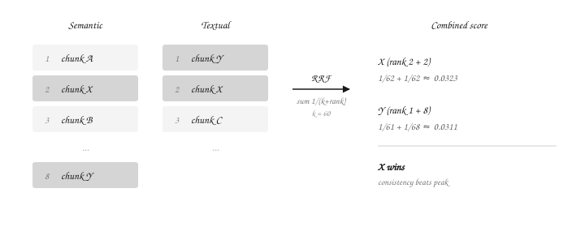

My first RAG felt like finding a hidden treasure. Then I asked it a simple question and it returned every wrong answer in the corpus. That one failure taught me everything I now know about retrieval.

When we started OSIX Tech in June 2025, we were already mid-project. NotebookLM was still in its early days, and Claude or ChatGPT couldn't reach into your files. We were asked to build a document assistant connected directly to Google Drive that could retrieve updated data on demand.

I had zero idea what RAG was, or what retrieval strategies existed. A little research and I found embeddings. I started thinking about all the doors this opened, and the first prototype came alive.

## Embeddings don't do literal lookup

To eval the project, we threw together a benchmark with legal documents. Calling it an eval is generous. My first reality check was running it and realizing queries like "What does the Article 11 say?" were returning all kinds of articles, but not necessarily 11.

I just sat there, in front of my laptop, questioning why my beloved embedding system was failing me for the 5th time in a row, and then I realized it had every right to fail me.

Embeddings are vector representations of the semantic meaning of a chunk of text. The embedding for "dog" sits closer to the embedding for "cat" than to the embedding for "computer". So the query "animals" returns "dog" and "cat" before "computer". The same goes for a more complex query like "do I have pets". Embeddings measure semantic distance, not literal matching.

For me, the query "What does the Article 11 says?" pushed embeddings to their limits and made me understand them, because you don't understand something completely until it fails.

The "why" comes down to two things: vector size and chunk size. Vector size is a property of the embedding model you pick (common values are 512, 1024, 1536, 3072). It's mostly fixed by your choice of model. Chunk size is the lever you actually control.

Here's the catch. An embedding always compresses the input into the same fixed shape, no matter how much you feed in. A focused 500-word paragraph and 2000 tokens of rambling both produce the same-sized vector. Long noisy chunks get averaged out: the meaningful sentences in there blur into the surrounding filler, and small differences between chunks vanish. So "just dump it all in" is NOT a free upgrade.

Chunk into 500-token pieces and you get four sharper embeddings, each preserving its own meaning. Go too small and you lose the context that makes a paragraph a paragraph. The sweet spot depends on what you're embedding.

To an embedding model, the difference between "Article 11" and "Article 12" is tiny compared to the semantic weight of everything around them. In a 200-token chunk full of legal context, the number itself barely shifts the embedding. There's no chunk size that fixes that.

## Textual search has the opposite problem

So what do we do? If we're searching for "11", why bother with semantic significance? Why not just look for literal matches to "11"? Nice intuition. I tried it.

My RAG was agentic from the start. The agent could search on demand whenever he needed more info. So I let him pick: semantic or textual.

In textual retrieval (BM25 in most production setups), chunks get ranked by query term frequency, weighted by how rare the term is across the corpus, and normalized by chunk length. Saturation is built in, so each additional mention helps a little less than the last. But BM25 still rewards term frequency, and length normalization punishes longer chunks. A short chunk that name-drops "11" can outrank a long chunk that actually explains it. Take "As said on article 11, this is false, and even though article 11 left a window to the doubt, it's completely false". That chunk wins on "11" frequency in a short span, even though it never answers anything. To BM25, mentioning is the same as explaining.

What we needed was a way to find chunks where "11" actually appears AND the surrounding text explains it. How do you combine those?

## Combining both worlds with RRF

Hybrid search means running semantic and textual side by side and merging the rankings. The merge is where it gets ugly. I started by assigning weights to each and tuning them, but my eval was too noisy to tell if the weights were doing anything. So after a little research, I landed on Reciprocal Rank Fusion (RRF).

RRF scores each chunk by combining its rank from both rankings (the formula sums 1/(k+rank), with k usually 60, which flattens differences between top ranks). If chunk X is rank 2 in both semantic and textual, and chunk Y is rank 1 in textual but rank 8 in semantic, X wins. Y had the higher peak, but X was consistently good in both. Consistency beats occasional brilliance.

This heavily improved retrieval for both worlds. I could finally ask him about article 14 or 15, trusting he'd find it.

This was just the first reality. The system grew layers, each one a fix for another query the previous setup couldn't handle, another failure mode the layer below couldn't see. Production RAG isn't a recipe. It's a pile of fixes for problems you only find by hitting them.

And it all started by questioning "What does the Article 11 says?"
